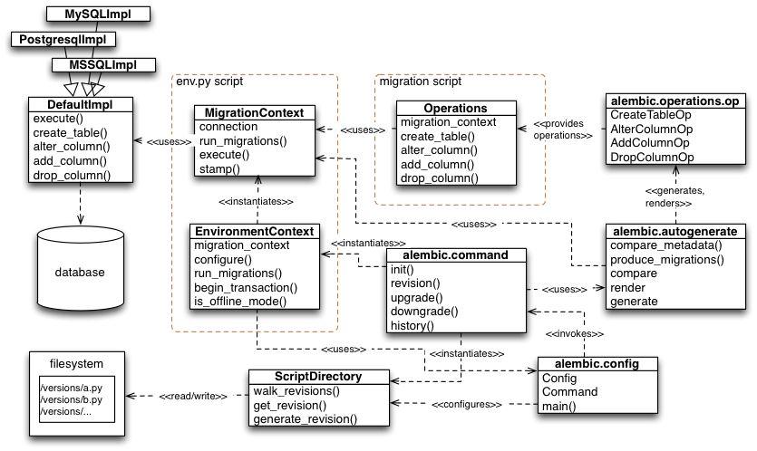

# Overview

[Configuration]: ../en/config.html#alembic-config-toplevel
[Config]: ../zh/08_03_configuration.md
[Commands]: ../en/commands.html#alembic-command-toplevel
[ScriptDirectory]: ../en/script.html#alembic.script.ScriptDirectory
[EnvironmentContext]: ../en/runtime.html#alembic.runtime.environment.EnvironmentContext
[MigrationContext]: ../en/runtime.html#alembic.runtime.migration.MigrationContext
[EnvironmentContext.configure()]: ../en/runtime.html#alembic.runtime.environment.EnvironmentContext.configure
[DefaultImpl]: ../en/ddl.html#alembic.ddl.impl.DefaultImpl
[Operations]: ../en/../ops.html#alembic.operations.Operations
[Built-in Operation Objects]: ../en/operations.html#alembic-operations-ops-toplevel
[Autogeneration]: ../en/autogenerate.html#alembic-autogenerate-toplevel
[alembic.command.revision()]: ../en/commands.html#alembic.command.revision

> **Note:** this section is a technical overview of the **internal API of Alembic**. This section is only useful for developers who wish to extend the capabilities of Alembic; for regular users, reading this section is **not necessary**.

A visualization of the primary features of Alembic’s internals is presented in the following figure. The module and class boxes do not list out all the operations provided by each unit; only a small set of representative elements intended to convey the primary purpose of each system.

The script runner for Alembic is present in the **[Configuration]** module. This module produces a **[Config]** object and passes it to the appropriate function in **[Commands]**. Functions within **[Commands]** will typically instantiate an **[ScriptDirectory]** instance, which represents the collection of version files, and an **[EnvironmentContext]**, which is a configurational facade passed to the environment’s `env.py` script.

The **[EnvironmentContext]** object is the primary object used within the `env.py` script, whose main purpose is that of a facade for creating and using a **[MigrationContext]** object, which is the actual migration engine that refers to a database implementation. The primary method called on this object within an `env.py` script is the **[EnvironmentContext]**.configure() method, which sets up the **[MigrationContext]** with database connectivity and behavioral configuration. It also supplies methods for transaction demarcation and migration running, but these methods ultimately call upon the **[MigrationContext]** that’s been configured.

MigrationContext is the gateway to the database for other parts of the application, and produces a **[DefaultImpl]** object which does the actual database communication, and knows how to create the specific SQL text of the various DDL directives such as ALTER TABLE; **[DefaultImpl]** has subclasses that are per-database-backend. In “offline” mode (e.g. `--sql`), the **[MigrationContext]** will produce SQL to a file output stream instead of a database.

During an upgrade or downgrade operation, a specific series of migration scripts are invoked starting with the **[MigrationContext]** in conjunction with the ScriptDirectory; the actual scripts themselves make use of the **[Operations]** object, which provide the end-user interface to specific database operations. The **[Operations]** object is generated based on a series of “operation directive” objects that are user-extensible, and start out in the **[Built-in Operation Objects]** module.

Another prominent feature of Alembic is the “autogenerate” feature, which produces new migration scripts that contain Python code. The autogenerate feature starts in **[Autogeneration]**, and is used exclusively by the **[alembic.command.revision()]** command when the `--autogenerate` flag is passed. Autogenerate refers to the **[MigrationContext]** and **[DefaultImpl]** in order to access database connectivity and access per-backend rules for autogenerate comparisons. It also makes use of **[Built-in Operation Objects]** in order to represent the operations that it will render into scripts.
